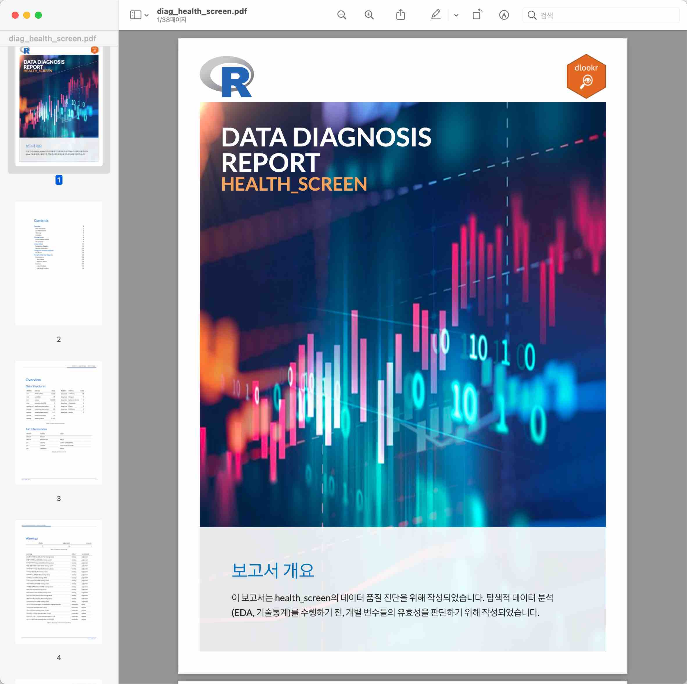

```{r setup, include=FALSE}
knitr::opts_chunk$set(echo = FALSE)
```

# 기능적 특징

## 다국어 지원

BitStat은 메뉴와 메시지 등 UI 레벨에서 한글과 영문을 지원합니다. 

```{r i18n, echo=FALSE, eval=FALSE}
img_i18n <- c("img/bitstat_kor.jpg", "img/bitstat_eng.jpg")

tbl_i18n <- tibble::tibble(filename = img_i18n)

slickR::slickR(obj = img_i18n, width = 700, height = 352)
```


## 데이터 분석 보고서 지원

BitStat은 pdf와 html 포멧의 각종 보고서 작성을 지원합니다.

### pdf 포맷 보고서

pdf 포맷 보고서는 정적 컨텐츠를 제공하며, 데이터 분석 프로젝트의 산출물로 활용이 가능합니다.

<a href="img/diag_health_screen.pdf" target="_blank">
  
</a>


### html 포맷 보고서

html 포맷 보고서는 동적 컨텐츠를 제공하며, 독립적으로 심층적인 데이터 분석의 수행이 가능합니다.

<a href="img/diag_health_screen.html" target="_blank">
  
</a>

## 도움말 및 튜토리얼 지원

rmarkdown 기반의 도움말과 튜토리얼은 사용자가 데이터 분석을 쉽게 수행할 수 있도록 가이드를 제공합니다.


# 구조적 특징

## R & shiny 
R 패키지로 개발되며, shiny 앱으로 UI/UX를 구현하였습니다.

### R 패키지
R 패키지로 배포가 가능합니다.

### shiny
shiny 앱을 구성합니다. 
프로토타이핑의 Look & Feal은 shinydashboard로 구현되었습니다.


## Server Hosting & Local Hosting

### Server
BitStat는 데이터 분석 Server로서 클라우드 환경에 배포되어 데이터 분석을 지원합니다.


### Desktop
BitStat는 사용자 컴퓨터에서 구동되어 데이터 분석 수행을 지원합니다.


## dlookr & alookr 
BitStat는 dlookr, alookr 패키지의 기능을 최적화 하여 지원합니다.

### dlookr
dlookr 패키지는 데이터 진단, 탐색적 데이터 분석, 통계적 데이터 변환 기능을 UI/UX 기반과 보고서 기반으로 최적화  및 자동화 합니다.

```{r dlookr, echo=FALSE, out.width = "10%"}
knitr::include_graphics("img/dlookr.png")
```


### alookr
alookr 패키지는 분석 데이터 분할, 이진 분류 모델 적합 및 모델 검증을 자동화하는 AutoML 기능을 지원합니다.


```{r alookr, echo=FALSE, out.width = "10%"}
knitr::include_graphics("img/alookr.png")
```


