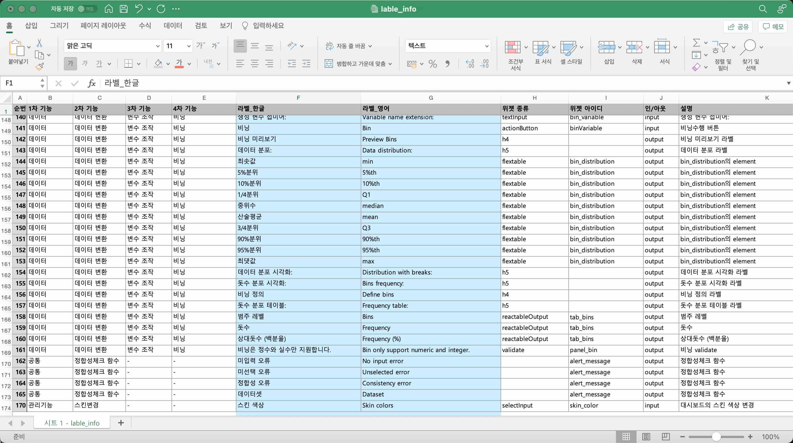
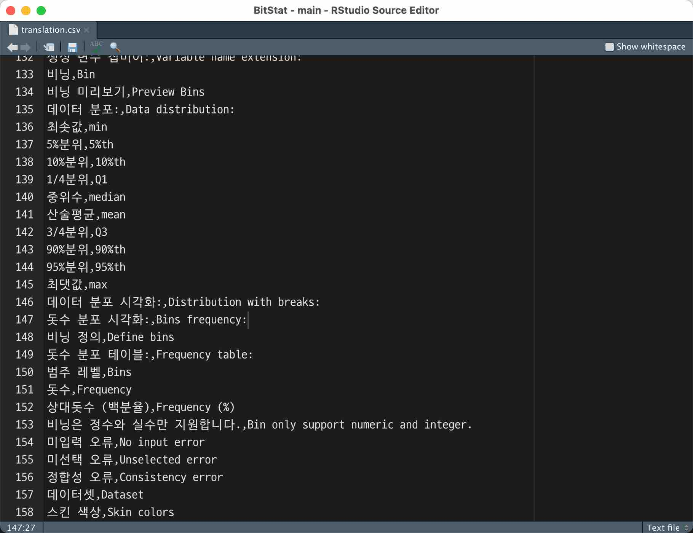

```{r setup, include=FALSE}
knitr::opts_chunk$set(echo = FALSE)

library(shiny)
library(htmltools)
```

# BitStat 현황
     
## 개발 버전     
핸재 BitStat는 개발 버전으로 0.5.0.9001 버전 번호를 달고 있습니다. 개발 버전인 관계로 CRAN에 등록되어 있지 않고,
github([https://github.com/bit2r/BitStat](https://github.com/bit2r/BitStat){target="_blank"})에만 등록되어 있습니다.

## 프로토타이핑
현재는 프로토타이핑 개발 버전입니다. 그런데 제품(Product) 개발 버전으로 프로젝트가 변경될 경우에는 UI/UX의 골격이 바뀔 수도 있습니다.
현재는 기능적인 프로토타이핑 중으로 UI/UX는 shinydashboard를 채용하고 있습니다.


# BitStat 구조
BitStat는 Shiny 앱이면서 R 패키지입니다.

## 소스 디렉토리 구조
* inst
    + app
        + www
            + img
                + 이미지 보관 디렉토리
            + meta
                + list_datasets.rds
                    + BitStat 데이터셋 R 데이터 파일
                + <span style="color: var(--custom-blue)">**lable_info.xlsx**</span> 
                    + <span style="color: var(--custom-blue)">**translation.csv 파일을 작성하기 위한 상세 정보**</span> 
            + <span style="color: var(--custom-blue)">**docs**</span> 
                + <span style="color: var(--custom-blue)">**도움말 파일 위치 (현재 미생성)**</span> 
        + menu
            + data_ui.R
                + 데이터 관련 메뉴의 UI 기능 구현
            + <span style="color: var(--custom-blue)">**기능명_ui.R**</span> 
                + <span style="color: var(--custom-blue)">**기능이 추가될 때마다 생성**</span> 
        + tools
            + data.R
                + 데이터 관련 메뉴의 Server side 기능 구현
            + <span style="color: var(--custom-blue)">**기능명.R**</span> 
                + <span style="color: var(--custom-blue)">**기능이 추가될 때마다 생성**</span>                 
        + global.R
        + server.R
        + ui.R
    + translation
        + <span style="color: var(--custom-blue)">**translation.csv**</span> 
            + <span style="color: var(--custom-blue)">**i18n을 위한 메뉴/메시지 메타파일**</span> 
* R 
    + 패키지 소스 파일로 앱과 연관관계가 적은 공통 기능 구현


# i18n (Internationalization)
i18n을 구현하는 방법을 살펴보자.

## i18n을 위한 위젯 정보 파일
i18n을 위한 위젯 정보 파일인 lable_info.xlsx은 위젯들에 대한 정보를 담고 있는 엑셀 파일로 다음과 같은 컬럼을 가지고 있습니다.

* 1차 기능
    + 기능분류의 1단계
* 2차 기능
    + 기능분류의 2단계
* 3차 기능
    + 기능분류의 3단계
* 4차 기능
    + 기능분류의 4단계
* 라벨_한글
    + 한글 라벨  
* 라벨_영어
    + 영문 라벨 
* 위젯 종류
    + 위젯의 종류
* 위젯 아이디
    + 프로그램에서의 위젯 아이디
* 인/아웃
    + 입/출력 여부
* 설명
    + 위젯에 대한 설명




```{r, sol-1}
div(class = "bg-orange", 
    h4(icon("lightbulb", style = "margin-right: 5px;"), 
       "협업 포인트", style = "margin-bottom: 30px; margin-top: 0px; padding-top: 0px;"), 
    "1. 일정 분량의 소스 코드가 개발되면, 문서에 정리한다.", br(),
    "2. 한글 라벨에 대응하는 영문 라벨을 번역한다.", br(),
    "3. 기 작성 라벨의 오탈자, 오역을 수정한다.")
```


## translation.csv
i18n을 위한 메뉴/메시지 메타파일인 translation.csv은 lable_info.xlsx 파일의 "라벨_한글", "영문 라벨" 컬럼을 복사하여 만듭니다.



## 변환을 위한 R 코드
translate() 함수에 translation.csv에 정의된 한글 메뉴/메시지를 입력하면 됩니다.

```{r, echo=TRUE, eval=TRUE, message=FALSE}
library(BitStat)
assign("language", "en", envir = .BitStatEnv)

translate("범주 레벨 순서변경:")

translate("범주 레벨 변경/병합은 범주형 데이터만 지원합니다. 원한다면 먼저 범주형 데이터로 변경 후 진행하세요.")
```


## BitStat 실행하기

### 한글 메뉴 실행하기

한글 메뉴가 기본이기 때문에 launch() 함수만 호출하면 됩니다.

```{r, eval=FALSE, echo=TRUE}
library(BitStat)

launch()
```

### 영어 메뉴 실행하기

영어 메뉴는 language 인수값에 "en"을 지정하여 launch() 함수를 호출하면 됩니다.

```{r, eval=FALSE, echo=TRUE}
library(BitStat)

launch(language = "en")
```

# 도움말

BitStat 활용도를 높이기 위해서 도움말을 제공할 계획입니다.

## Vignettes
BitStat의 소개를 중심으로 도움말을 작성합니다.

## 도움말 메뉴
기능별로 상세하게 도움말을 작성합니다.

* rmarkdown을 이용해서 도움말을 작성합니다.
* 사례 중심의 도움말을 작성합니다.
    + 사례 발굴이 필요합니다.
        + 데이터, 분석 시나리오 등

```{r, sol-2}
div(class = "bg-orange", 
    h4(icon("lightbulb", style = "margin-right: 5px;"), 
       "협업 포인트", style = "margin-bottom: 30px; margin-top: 0px; padding-top: 0px;"), 
    "1. 기 개발 범위 내에서 도움말 메뉴를 작성한다.", br(),
    "2. 향후 개발 범위에 대해서 내장 데이터 기반의 도움말 시나리오를 만든다.", br(),
    "3. Vignettes을 작성한다.")
```
